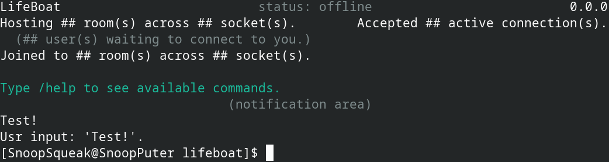

# LifeBoat
Status: Non functioning, work-in-progress.

A project by [SnoopSqueak](https://snoopsqueak.com).

The goal is to create a peer-to-peer self-hosted secure chat app.

It is small and simple for maximum accessibility.

The C code in this project is intended to be:
- Beginner-friendly
- Easy to maintain, update, replace, port, etc.
- Created without using "AI" - I'm a human! :) ... :(

### Programming style:
Inspired by this [Linux kernel coding style guide](https://www.kernel.org/doc/html/latest/process/coding-style.html).

Philosophy:
- Divide a big, unmanageable thing into manageable pieces we can focus on.
- Organize files and code into groups of 3-7 things for human manageability.
- A passing thing is the goal. A failing thing is better than nothing.

Readability:
- Limit every line of code to 80 characters at most.
- Use 8 spaces of indentation to discourage nesting and long lines.
- Aim for concise variable and function names.

Performance:
- Pass by reference to reduce value duplication.
- Avoid redundant memory allocation. Make careful use of pointers.
- Aim for responsiveness without wasting many cycles.

Clarity:
- Avoid global variables.
- Avoid unnecessary use of typedef.
- Avoid enums.

This project is using [Munit](https://nemequ.github.io/munit/#) by [nemequ](https://github.com/nemequ) for testing.

Nothing is set in stone. Thank you for reading.
